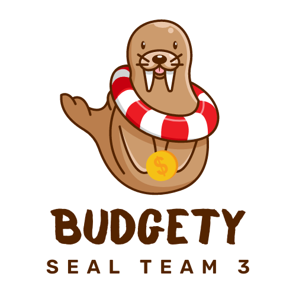
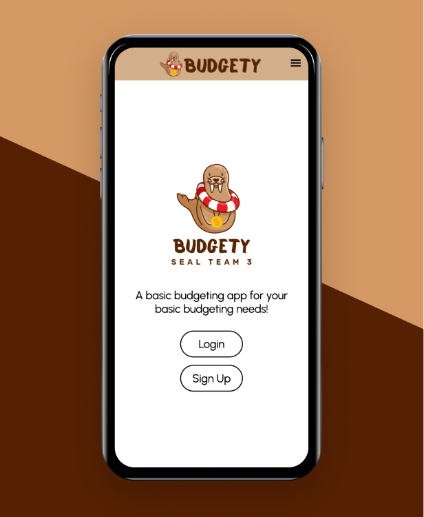

<!-- ALL-CONTRIBUTORS-BADGE:START - Do not remove or modify this section -->
[](#contributors-)
<!-- ALL-CONTRIBUTORS-BADGE:END -->
<p align="center">
    <a href="https://heroku.com" target="_blank">
        
    </a>
    
<p/>


<h4 align="center"> Don't be surprised the next time you go broke!<br>Create your very own budgets with Budgety.</h4>
<br>
<p align="center">
<a href="https://github.com/bretpeters3n/seal-team-3/blob/master/LICENSE" target="blank">

</a>
<a href="https://github.com/bretpeters3n/seal-team-3/fork" target="blank">

</a>
<a href="https://github.com/bretpeters3n/seal-team-3/stargazers" target="blank">

</a>
<a href="https://github.com/bretpeters3n/seal-team-3/issues" target="blank">

</a>
<a href="https://github.com/bretpeters3n/seal-team-3/pulls" target="blank">

</a>
<!--
<a href="https://twitter.com/intent/tweet?text=👋%20Check%20this%20amazing%20app%20https://tryshape.vercel.app/,%20created%20by%20@tapasadhikary%20and%20friends%0A%0A%23DEVCommunity%20%23100DaysOfCode%20%23tryshape"></a>
-->

</p>

<p align="center">
    <a href="https://budgety-front.uc.r.appspot.com/" target="blank">View Demo</a>
    ·
    <a href="https://github.com/bretpeters3n/seal-team-3/issues/new/choose">Report Bug</a>
    ·
    <a href="https://github.com/bretpeters3n/seal-team-3/issues/new/choose">Request Feature</a>
</p>

# 👋 Introducing `Budgety`
<p align="center">
    <a href="https://Budgety.vercel.app" target="blank"/>
        
    </a>
</p>

`Budgety` is an opensource platform to create budgets with an easy-to-use interface. You can create incomes and expenses and keep track of your spending.

# 🚀 Demo
Here is a quick demo of the app. We hope you enjoy it.

> [The Demo Link](https://budgety-front.uc.r.appspot.com/)

Liked it? Please give a ⭐️ to <b>Budgety</b> to build its triceps 💪 stronger.

### Many Thanks to all the `Stargazers` who has supported this project with stars(⭐)

[](https://github.com/bretpeters3n/seal-team-3/stargazers)

# 💻 Use Budgety
Please access Budgety using the URL:

> https://budgety-front.uc.r.appspot.com/

# 🔥 Features
`Budgety` comes with a bundle of features already. You can do the followings with it:

## 🔑 User Authentication
- Users can create an account, log in, log out, and have all of their user info saved to their account.

## 🏗️ Basic CRUD Capabilities for Income and Expenses
- Users can create, read, update, and delete income entries.
- Users can create, read, update, and delete expense entries.

## 💾 Save User's Budget and Persist Data to Backend
- MongoDB and Mongoose are playing a large role in this feature.

## 📱 Responsive and mobile-friendly
- Use `Budgety` seamlessly from any device.

# 🏗️ How to Set up `Budgety` for Development?
You can run Budgety locally with a few easy steps.

1. Clone the repository

```sh
git clone https://github.com/bretpeters3n/seal-team-3.git
```

2. Change the working directory

```bash
cd seal-team-3
```

3. Change the working directory again

```bash
cd client
```

4. Install dependencies (frontend)

```bash
npm install
```

5. Back out one directory

```bash
cd ..
```

6. Change the working directory yet again

```bash
cd server
```

7. Install dependencies (backend)

```bash
npm install
```

8. Create `.env` file in 'server' and add a variable

```bash
SECRET_KEY='whatever secret key here'
```

9. Start running the backend (this requires Mongo to be locally installed and running)

```bash
nest start
```

10. Back out of 'server' directory

```bash
cd ..
```

11. Enter 'client' directory again

```bash
cd client
```

12. Start running the frontend

```bash
npm run start
```

That's All!!! Now open [localhost:3000](http://localhost:3000/) to see the app.

# 🍔 Built With
Backend
- [Nest JS](https://nestjs.com/): A progressive Node.js framework for building efficient, reliable and scalable server-side applications.
- [@nestjs/common](https://www.npmjs.com/package/@nestjs/common)
- [@nestjs/config](https://www.npmjs.com/package/@nestjs/config): Configuration module for Nest based on the dotenv (to load process environment variables) package.
- [@nestjs/core](https://www.npmjs.com/package/@nestjs/core)
- [@nestjs/jwt](https://www.npmjs.com/package/@nestjs/jwt): JWT utilities module for Nest based on the jsonwebtoken package.
- [@nestjs/mongoose](https://www.npmjs.com/package/@nestjs/mongoose): Mongoose module for Nest.
- [@nestjs/passport](https://www.npmjs.com/package/@nestjs/passport): Passport utilities module for Nest.
- [@nestjs/platform-express](https://www.npmjs.com/package/@nestjs/platform-express)
- [@types/mongodb](https://www.npmjs.com/package/@types/mongodb)
- [bcrypt](https://www.npmjs.com/package/bcrypt): A library to help you hash passwords.
- [dayjs](https://www.npmjs.com/package/dayjs): Fast 2kB alternative to Moment.js with the same modern API
- [dotenv](https://www.npmjs.com/package/dotenv): Dotenv is a zero-dependency module that loads environment variables from a .env file into process.env
- [mongoose](https://www.npmjs.com/package/mongoose): Mongoose is a MongoDB object modeling tool designed to work in an asynchronous environment. Mongoose supports both promises and callbacks.
- [passport](https://www.npmjs.com/package/passport): Passport is Express-compatible authentication middleware for Node.js.
- [passport-jwt](https://www.npmjs.com/package/passport-jwt): A Passport strategy for authenticating with a JSON Web Token.
- [reflect-metadata](https://www.npmjs.com/package/reflect-metadata)
- [rimraf](https://www.npmjs.com/package/rimraf): The UNIX command rm -rf for node.
- [rxjs](https://www.npmjs.com/package/rxjs): Reactive Extensions Library for JavaScript.
<br><br>

Frontend
- [@hookform/resolvers](https://www.npmjs.com/package/@hookform/resolvers): Performant, flexible and extensible forms with easy to use validation.
- [@testing-library/jest-dom](https://www.npmjs.com/package/@testing-library/jest-dom): Custom jest matchers to test the state of the DOM
- [@testing-library/react](https://www.npmjs.com/package/@testing-library/react): Simple and complete React DOM testing utilities that encourage good testing practices.
- [@testing-library/user-event](https://www.npmjs.com/package/@testing-library/user-event): Fire events the same way the user does
- [@types/jest](https://www.npmjs.com/package/@types/jest): TypeScript definitions for Jest
- [@types/node](https://www.npmjs.com/package/@types/node): TypeScript definitions for Node.js
- [@types/react](https://www.npmjs.com/package/@types/react): TypeScript definitions for React
- [@types/react-dom](https://www.npmjs.com/package/@types/react-dom): TypeScript definitions for React (react-dom)
- [@types/react-router](https://www.npmjs.com/package/@types/react-router): TypeScript definitions for React Router
- [@types/react-router-dom](https://www.npmjs.com/package/@types/react-router-dom): TypeScript definitions for react-router-dom
- [@types/styled-components](https://www.npmjs.com/package/@types/styled-components): TypeScript definitions for styled-components
- [axios](https://www.npmjs.com/package/axios): Promise based HTTP client for the browser and node.js
- [framer-motion](https://www.npmjs.com/package/framer-motion): A simple and powerful React animation library
- [react](https://www.npmjs.com/package/react): React is a JavaScript library for building user interfaces.
- [react-confetti](https://www.npmjs.com/package/react-confetti): React component to draw confetti for your party.
- [react-dom](https://www.npmjs.com/package/react-dom): React package for working with the DOM.
- [react-hook-form](https://www.npmjs.com/package/react-hook-form): Performant, flexible and extensible forms library for React Hooks
- [react-icons](https://www.npmjs.com/package/react-icons): SVG React icons of popular icon packs using ES6 imports
- [react-router](https://www.npmjs.com/package/react-router): Declarative routing for React
- [react-router-dom](https://www.npmjs.com/package/react-router-dom): Declarative routing for React web applications
- [react-scripts](https://www.npmjs.com/package/react-scripts): Configuration and scripts for Create React App.
- [styled-components](https://www.npmjs.com/package/styled-components): Visual primitives for the component age. Use the best bits of ES6 and CSS to style your apps without stress
- [sweetalert2](https://www.npmjs.com/package/sweetalert2): A beautiful, responsive, customizable and accessible (WAI-ARIA) replacement for JavaScript's popup boxes, supported fork of sweetalert
- [typescript](https://www.npmjs.com/package/typescript): TypeScript is a language for application scale JavaScript development
- [web-vitals](https://www.npmjs.com/package/web-vitals): Easily measure performance metrics in JavaScript
- [yup](https://www.npmjs.com/package/yup): Dead simple Object schema validation


# 🛡️ License
This project is licensed under the MIT License - see the [`LICENSE`](LICENSE) file for details.


# 🦄 Upcoming Features
`Budgety` has all the potential to grow further. Here are some of the upcoming features planned(not in any order),

- ✔️ Common budget categories that can be selected when inputing an expense
- ✔️ Basic CRUD Capabilities for budget categories
- ✔️ Ability to set budget goals on weekly/monthly basis
- ✔️ Unit testing
- ✔️ Saving & Investing (no specific details here yet)
- ✔️ Connect to a fake bank account API that automatically generates expenses and income
- ✔️ Predict future spending based on previous habits
- ✔️ Send out low balance information to email or by text message
- ✔️ Investing advice (possible pull from API and serve as a between screen when loading data)
<!--
If you find something is missing, `Budgety` is listening. Please create a feature request [from here](https://github.com/bretpeters3n/seal-team-3/issues/new/choose).


# 🤝 Contributing to `Budgety`
Any kind of positive contribution is welcome! Please help us to grow by contributing to the project.

If you wish to contribute, you can work on any features [listed here](https://github.com/bretpeters3n/seal-team-3#-upcoming-features) or create one on your own. After adding your code, please send us a Pull Request.

> Please read [`CONTRIBUTING`](CONTRIBUTING.md) for details on our [`CODE OF CONDUCT`](CODE_OF_CONDUCT.md), and the process for submitting pull requests to us.
-->

---

## Contributors ✨

Thanks goes to these wonderful people:

<!-- ALL-CONTRIBUTORS-LIST:START - Do not remove or modify this section -->
<!-- prettier-ignore-start -->
<!-- markdownlint-disable -->
<table>
  <tr>
    <td align="center"><a href="https://bretpetersen.com"><br /><sub><b>Bret Petersen</b></sub></a><br />
    <td align="center"><a href="https://github.com/nirmalkc"><br /><sub><b>Jonathan Martinez</b></sub></a><br />
    <td align="center"><a href="https://github.com/williamzhu17"><br /><sub><b>Benjamin Cho</b></sub></a><br />
    <td align="center"><a href="https://savio.xyz/"><br /><sub><b>Mack N</b></sub></a><br />
  </tr>
</table>